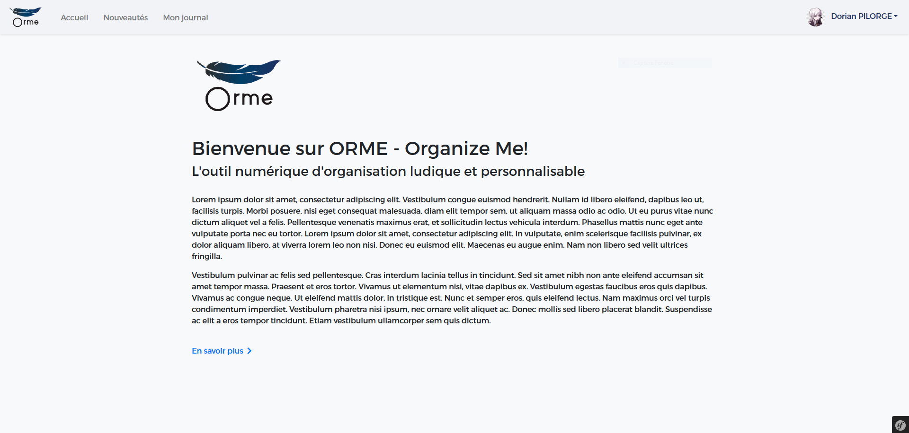
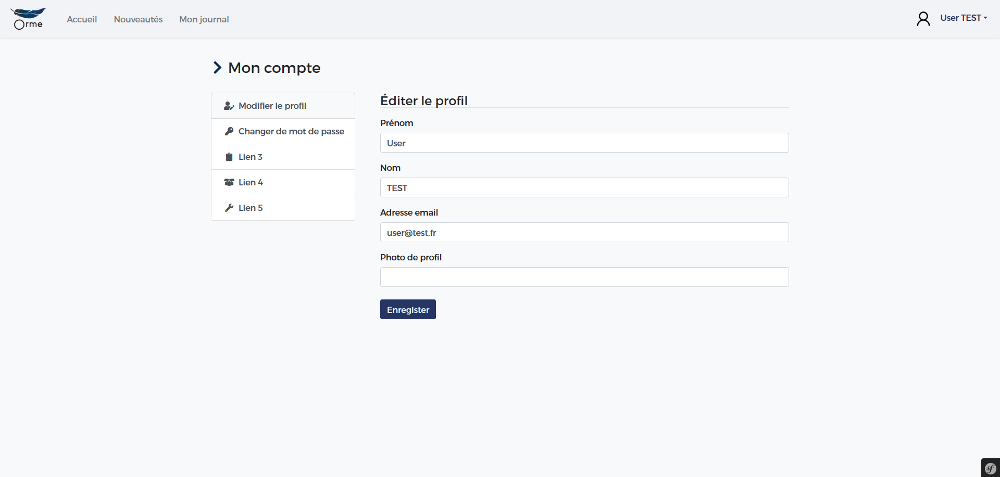

# OrganizeMe! (ORME!)

## Introduction
*ORME!* is a bullet journaling web application realized at MyDigitalSchool.

This repository contains the application part of the project.

To access the Website (WordPress) part ➤ [mds-orme-wp](https://github.com/Natsu235/mds-orme-wp)

## Getting started

### Prerequisites
List of all required softwares and dependencies to use with this project:
* PHP 7.3.5
* [Composer](https://getcomposer.org/) - Dependency Manager for PHP
* [Symphony 4](https://symfony.com/) - PHP Framework
* [Git](https://symfony.com/) - Project Versionning Manager

### Basic Commands
Git
* ```git pull origin master``` - Get all files from master branch
* ```git status``` - Check your local files status
* ```git add <file>``` - Prepare a file for a commit
* ```git commit -m <message>``` - Commit your previously added files
* ```git push origin master``` - Push your commit to the master branch

Composer
* ```composer install``` - Retrieve all required components of the project
* ```composer update``` - Update all required components of the project
* ```composer require <dependency>``` - Install a new dependency

Yarn
<<<<<<< HEAD
* ```yarn install``` - Install dependencies of the project
* ```yarn upgrade``` - Upgrades packages to their latest version
* ```yarn build``` - Build all files
* ```yarn watch``` - Refresh instantly all modifications

## Preview

Login Screen

<kbd></kbd>

Homepage

<kbd></kbd>

User Profile

<kbd></kbd>

=======
* ```yarn build``` - Build all files
* ```yarn watch``` - Refresh instantly all modifications

>>>>>>> 73c6a08ecbe4186a2955adb990b89658caca7040
## Miscellaneous

### Trello
[Trello](https://trello.com/) is a project management tool allowing us to schedule all of our tasks during the development.

<<<<<<< HEAD
<a href="https://trello.com/b/noJXXiYo/mdproject-dev" target="_blank"></a>
=======
<a href="https://trello.com/b/noJXXiYo/mdproject-dev" target="_blank"></a>
>>>>>>> 73c6a08ecbe4186a2955adb990b89658caca7040

### Licence
This project is licensed under the GPLv3 License. See the [LICENSE.md](LICENSE.md) file for details.
